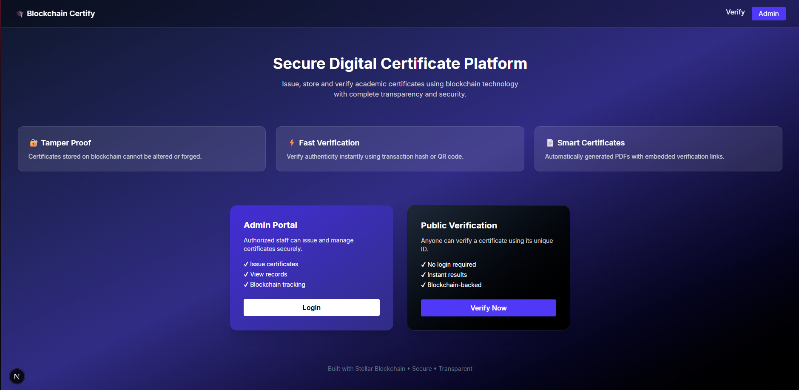
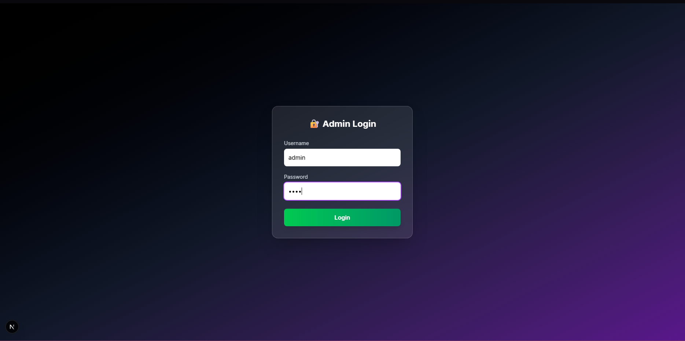
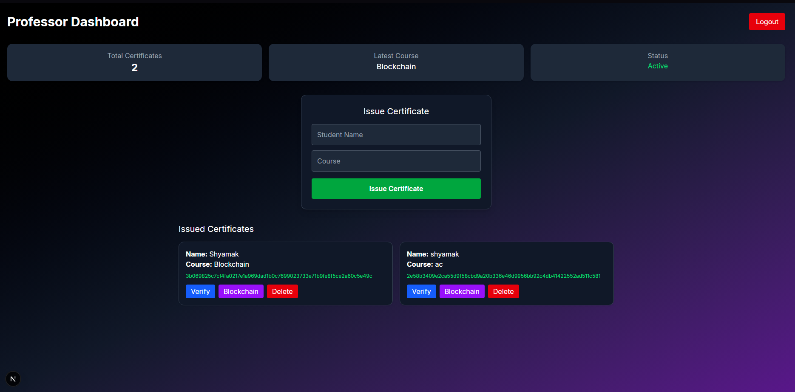
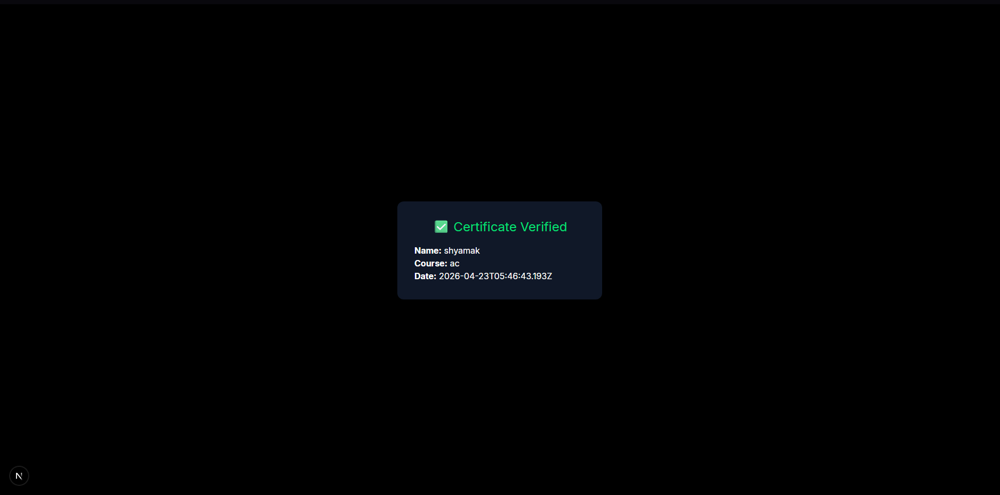
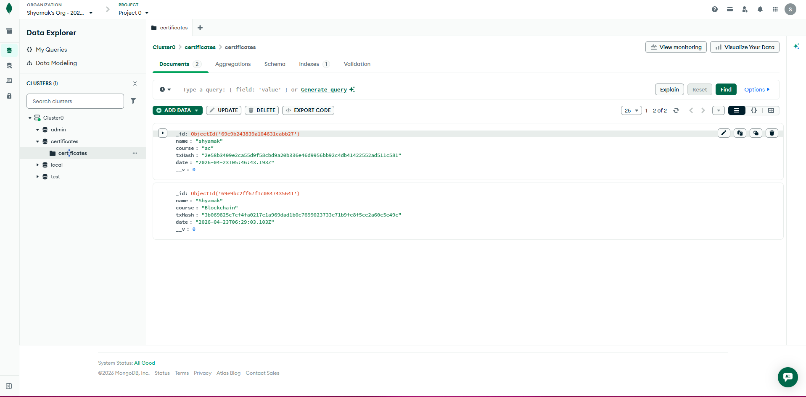
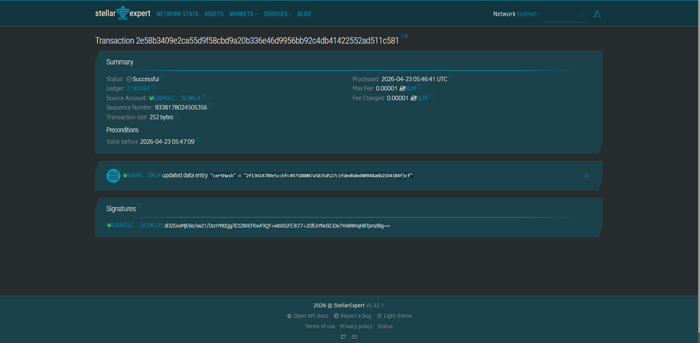

# 🎓 Blockchain-Based Certificate Issuance & Verification System

A full-stack web application to **issue, store, and verify academic certificates using blockchain technology (Stellar Testnet)**.

This system ensures certificates are:
- ✅ Tamper-proof
- ✅ Easily verifiable
- ✅ Publicly accessible
- ✅ Secure and decentralized

---

## 👨‍🎓 Project By

- **Shyamak Rath**  
  USN: 1DS23IC048  

- **Ullas V**  
  USN: 1DS23IC058  

📍 *Dayananda Sagar College of Engineering*  
Department of Computer Science (IoT & Cybersecurity including Blockchain)

---

## 🚀 Features

### 🔐 Blockchain Integration
- Certificate data is hashed using **SHA-256**
- Stored on **Stellar Blockchain (Testnet)**
- Immutable and tamper-proof

### 📄 Certificate Generation
- Auto-generated **PDF certificates**
- Includes **Transaction Hash**
- Embedded **QR Code for verification**

### 🔍 Public Verification System
- Verify using:
  - Transaction Hash
  - QR Code
- No login required
- Instant verification

### 👨‍🏫 Admin Dashboard
- Issue certificates
- View all issued certificates
- Delete certificates (database-level revoke)
- Track blockchain transactions

### 🌐 One-Click Verification Page
Accessible via:


/verify/{txHash}


Displays:
- Certificate details
- Blockchain verification status
- Transaction link

---

## 🏗️ Tech Stack

### Frontend
- Next.js (App Router)
- Tailwind CSS
- JavaScript

### Backend
- Node.js
- Express.js

### Database
- MongoDB Atlas

### Blockchain
- Stellar SDK (Testnet)
- Horizon API

### Libraries Used
- QRCode → QR generation  
- jsPDF → Certificate PDF  
- crypto → SHA-256 hashing  

---

## 📂 Project Structure

```
certificate-blockchain/
│
├── backend/
│ ├── models/
│ ├── routes/
│ ├── server.js
│ └── stellar.js
│
├── frontend/
│ ├── app/
│ │ ├── admin/
│ │ ├── verify/
│ │ ├── create/
│ │ ├── login/
│ │ └── page.js
│ ├── tailwind.config.js
│ └── postcss.config.js
│
├── qr/
├── .gitignore
└── README.md
```

---

## ⚙️ Installation & Setup

### 1️⃣ Clone Repository

```bash
git clone https://github.com/LuhChonka/certificate-blockchain.git
cd certificate-blockchain
```
## ⚙️ Installation & Setup

### 1️⃣ Clone Repository
```bash
git clone https://github.com/LuhChonka/certificate-blockchain.git
cd certificate-blockchain
```

### 2️⃣ Backend Setup
```bash
cd backend
npm install
```

Create `.env` file:
```
MONGO_URI=your_mongodb_connection_string
```

Run backend:
```bash
node server.js
```

### 3️⃣ Frontend Setup
```bash
cd frontend
npm install
npm run dev
```

Open:
```
http://localhost:3000
```
## 🔄 System Workflow

### 📌 Certificate Issuance
1. Admin logs into dashboard  
2. Enters **student name** and **course**  
3. Backend:
   - Generates **SHA-256 hash**
   - Stores hash on **Stellar Blockchain**
   - Saves certificate data in **MongoDB**
   - Returns **transaction hash**
4. QR code is generated for verification  

---

### 🔍 Certificate Verification
1. User opens:
/verify/{txHash}
2. Frontend sends request to backend  
3. Backend:
- Fetches certificate from **MongoDB**
- Verifies transaction on **Stellar**
4. Displays result:
- ✅ Valid certificate  
- ❌ Invalid certificate  

---

## 🔌 API Endpoints

| Method | Endpoint | Description |
|--------|---------|------------|
| POST | `/cert/create` | Create certificate |
| GET | `/cert/all` | Get all certificates |
| GET | `/cert/verify/:txHash` | Verify certificate |
| DELETE | `/cert/delete/:id` | Delete certificate |

---

## 🧾 Sample Certificate Data

```json
{
"name": "John Doe",
"course": "Blockchain Fundamentals",
"txHash": "3b6f2a91c..."
}
```
## ⚠️ Limitations

> ⚠️ **Note:** This system is built for academic/demo purposes.

- 🔒 Blockchain data is **permanent and immutable**  
- 🗄️ Only off-chain (database) records can be deleted  
- 🧪 Runs on **Stellar Testnet** (not mainnet)  
- 🔑 Uses basic login authentication  

## 📸 Screenshots

### 🎨 Frontend

#### 🏠 Home Page


#### 👨‍🏫 Admin Dashboard


#### 📜 Issued Certificates


#### 🔍 Certificate Verification


---

### ⚙️ Backend & Blockchain

#### 🗄️ MongoDB Database (Stored Certificates)


#### ⭐ Stellar Blockchain Transaction (Proof of Immutability)


---

### 📄 Generated Certificate

👉 [Download Certificate PDF](assets/certificate.pdf)

## 🤝 Contribution

This project is developed for academic purposes.

---

## 📜 License

For educational use only.

---

## ⭐ Acknowledgment

Inspired by blockchain-based verification systems and digital credential platforms.


